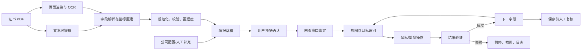

# 专利证书自动识别填报工具——项目计划与设计基线

> 文档版本：v0.8  
> 更新日期：2026-08-04  
> 项目状态：M6 稳定性与批量能力已完成；队列、失败恢复、版本回滚和离线运维包已实现，保存/删除仍由用户人工执行  
> 暂定运行环境：Windows，公司内网，Edge/Chrome 浏览器

## 1. 项目目标

开发一个 Windows 桌面工具，从专利证书 PDF 中提取结构化信息，在用户已经登录并打开公司内网“专利信息库”填报页面后，通过屏幕识别、窗口截图、鼠标和键盘操作完成辅助填报。

本项目不接入网站后端、不修改网页、不注入脚本，也不依赖公网服务。最终保存前必须由用户人工检查并确认。

项目成功不等于“鼠标能点到输入框”，而是同时满足：

1. 证书信息提取准确，无法确认的数据明确提示，不静默猜测。
2. 自动化只在识别到正确页面和正确字段时执行。
3. 每个关键填报动作完成后均有验证结果。
4. 内网现场出现问题时，能够通过脱敏诊断包定位原因。
5. 程序默认停在“保存”之前，由用户完成最终审核。

## 2. 已知条件与核心约束

### 2.1 已知条件

- 已有 50 份专利证书样本：此前提供 20 份，本次新增 30 份。
- 已有完整的 Edge 内网页面截图，已用于建立首版字段地图和页面 Profile。
- 实际网站只能在公司内网访问，开发环境不能直接打开或远程调试该网站。
- 用户可在现场手动运行程序、截图、导出日志并反馈测试结果。
- 目标交互方式类似 MAA：观察屏幕、识别目标、执行动作、再次观察并验证。

### 2.2 约束

- 不使用浏览器扩展、网页脚本注入、DOM 定位或内嵌网页。
- 不自动处理登录、短信验证、验证码和单点登录。
- 不在未经用户确认时点击“保存”“提交”“删除”等不可逆按钮。
- 证书可能含公司内部信息，OCR、日志和配置默认仅在本机处理及保存。
- 屏幕缩放、浏览器缩放、窗口尺寸和网站版本变化都会影响黑盒自动化，必须纳入环境校验。

## 3. 样本基线

### 3.1 本次 20 份证书的检查结论

| 检查项 | 结论 |
|---|---|
| 文件数量 | 20 |
| 总页数 | 20，全部为单页证书 |
| 文本层 | 20 份均可直接提取文字 |
| 类型分布 | 发明 8 份，实用新型 12 份 |
| 版式 | 同一代一页式电子证书；发明为红框，实用新型为绿框 |
| 联合权利人 | 第 9 份包含两个权利人，可覆盖联合申请/联合权利人测试 |
| 权利人变更 | 19 份的当前专利权人为“华电科工股份有限公司”，其中多数“申请日时申请人”为“华电重工股份有限公司” |
| 特殊专利号 | 第 20 份以 `X` 结尾，可覆盖校验位非数字场景 |
| 名单换行 | 多份证书的发明人跨行，PDF 文本层会把行末与下一行首姓名黏连 |

本次检查证明“一页式证书可以优先读取文本层”，但也证明“文本层有字”不等于“名单可直接按分号拆分”。解析器需要保留文字坐标或结合 OCR 行块，还原跨行前后的分隔关系。

### 3.2 26 份样本形成的版式覆盖

| 样本族 | 数量 | 特点 | 处理策略 |
|---|---:|---|---|
| 新版一页式、带文本层 | 21 | 本次 20 份及此前 1 份；主要字段集中在一页 | 文本层优先，坐标辅助 |
| 旧版两页式、带文本层 | 1 | 第二页包含申请人、发明人等字段 | 按页面标签解析 |
| 旧版两页式扫描件 | 4 | 无可靠文本层 | 页面渲染后 OCR |

这 26 份文件作为首版回归样本，但在开发开始前还需要建立人工核对过的标准答案（golden data），不能把文件名或当前脚本输出直接当作真值。

### 3.3 本次 20 份样本清单

| 序号 | 类型 | 专利号 | 名称 | 主要覆盖点 |
|---:|---|---|---|---|
| 1 | 发明 | ZL202010430096.0 | 一种海上风机基础、拖航及安装方法 | 多发明人、权利人变更 |
| 2 | 实用新型 | ZL202322987593.2 | 一种水库防冰盖输水管道装置 | 当前与申请日权利人相同 |
| 3 | 发明 | ZL202111424781.3 | 一种N型连续折叠式落水消声装置 | 多发明人跨行 |
| 4 | 实用新型 | ZL202420289616.4 | 一种隧洞高效施工装备 | 标准短名单 |
| 5 | 实用新型 | ZL202420071008.6 | 一种新型直流海缆 | 多发明人跨行 |
| 6 | 实用新型 | ZL202420289617.9 | 一种低振动抽水蓄能电站地下厂房 | 标准短名单 |
| 7 | 实用新型 | ZL202420609065.5 | 一种抽水蓄能电站水轮机进水排气装置 | 长标题 |
| 8 | 实用新型 | ZL202420638073.2 | 一种金属陶瓷粉末面层材料研发用检测装置 | 长标题 |
| 9 | 实用新型 | ZL202323116576.8 | 一种轨道车和吊装设备 | 两个权利人、长发明人名单 |
| 10 | 实用新型 | ZL202420139054.5 | 一种垃圾填埋场柔性光伏支架及安装基础 | 多发明人 |
| 11 | 发明 | ZL202010666385.0 | 一种带辅助桩的套筒式水下沉桩定位架装置及施工方法 | 超长标题、名单跨行 |
| 12 | 实用新型 | ZL202420912441.8 | 支架连接节点及光伏支架 | 标准名单 |
| 13 | 实用新型 | ZL202420119880.3 | 一种山地柔性光伏支架 | 多发明人 |
| 14 | 实用新型 | ZL202420987516.9 | 柔性光伏支架抗风稳定装置、柔性光伏支架及光伏系统 | 超长标题 |
| 15 | 发明 | ZL202010442159.4 | 一种消声片 | 长名单、名单跨行 |
| 16 | 发明 | ZL201910715061.9 | 一种装配式钢结构节点和装配式钢结构柱 | 标准短名单 |
| 17 | 发明 | ZL202010666561.0 | 一种舱底结构及坐底驳船 | 多发明人跨行 |
| 18 | 实用新型 | ZL202421159020.9 | 升压站转运工装 | 长名单、名单跨行 |
| 19 | 发明 | ZL202010442154.1 | 一种片式消声器 | 与第 15 份名单相近，适合一致性测试 |
| 20 | 发明 | ZL202011644446.X | 一种钢结构冷却塔围护结构 | 专利号以 X 结尾、长名单 |

## 4. 初版范围

### 4.1 MVP 包含

- 单份或多份拖入/选择专利证书 PDF。
- 文本层解析，扫描件自动转 OCR。
- 解析结果预览、置信度提示和人工修正。
- 公司固定值与经办人信息配置。
- 保存每份证书的结构化草稿，避免重复识别。
- 绑定用户指定的 Edge/Chrome 窗口。
- 填报前识别页面标题或关键字段，防止在错误窗口操作。
- 填写基本文本框、日期框、下拉框、复选框和人员/权利人表格。
- 适配权限截图中已确认可编辑的技术摘要、专利出处、项目关联、合并字段、动态表格、第一发明人选择器、PCT 下拉和经办人字段；其中证书不能提供的字段必须由用户或本地配置提供。
- 核验页面既有证书附件可预览/下载；附件上传作为后续可选功能。
- 提供模拟、只识别、单步、正式填报四种运行模式。
- 每步截图、识别结果、执行结果和错误原因可追踪。
- 全局停止热键；默认不点击最终“保存”。

### 4.2 MVP 不包含

- 自动登录、验证码识别或绕过安全验证。
- 自动点击最终“保存/提交”。
- 从公网查询专利法律状态或补齐证书之外的数据。
- 仅凭专利证书生成可靠的技术摘要；技术摘要虽然已显示编辑入口，但首版仍由用户人工填写或由后续说明书/台账模块提供。
- 因为页面显示了编辑入口，就自动猜填身份证号、联系方式、项目编号、所属单位、业务领域、PCT 选项或经办人信息。
- 在第一版直接进行无人值守的大批量连续填报。
- 兼容任意屏幕布局、任意浏览器版本和任意网站改版。

## 5. 实际使用流程

1. 用户启动桌面程序。
2. 用户在 Edge/Chrome 中登录公司内网，并打开一条新的专利填报页面。
3. 用户将证书 PDF 拖入程序。
4. 程序解析证书，显示字段、原文和置信度。
5. 用户补充证书中没有的内部字段（包括技术摘要、专利出处/项目关联、PCT、人员主数据和经办人信息），并修正黄色/红色提示项。
6. 用户点击“绑定网页窗口”，程序记录目标窗口并校验浏览器缩放与页面锚点。
7. 用户先运行“只识别”或“单步填报”，确认字段定位正常。
8. 用户点击“开始填报”，程序按状态机依次截图、识别、操作和验证；动态表格先核对行数、顺序和名称，再处理合并字段。
9. 程序在最终保存前停止，给出已填、跳过、待确认和失败字段清单。
10. 用户检查网页（包括可编辑的技术摘要、专利出处、项目关联、人员主数据和经办人字段）并手动保存。

若处理下一份证书，第一版建议仍由用户手动新建空白记录，再让程序填报，先避免把“新建记录”流程和数据填写耦合在一起。

## 6. 证书字段模型

解析器应同时保存“原始值、规范值、来源位置、置信度和人工确认状态”。建议核心结构如下：

```json
{
  "source_file": "证书.pdf",
  "certificate_template": "cnipa_one_page_2024",
  "patent_type": "utility_model",
  "certificate_no": "第22414291号",
  "title": "一种轨道车和吊装设备",
  "patent_no_raw": "ZL 2023 2 3116576.8",
  "patent_no": "ZL202323116576.8",
  "publication_no": "CN222433944U",
  "application_date": "2023-11-17",
  "grant_publication_date": "2025-02-07",
  "current_patentees": [
    "华电科工股份有限公司",
    "厦门力昌机械有限公司"
  ],
  "application_date_applicants": [
    "华电重工股份有限公司",
    "厦门力昌机械有限公司"
  ],
  "inventors": ["鲁成林", "逯鹏"],
  "application_date_inventors": ["鲁成林", "逯鹏"],
  "confidence": {
    "patent_no": 1.0,
    "inventors": 0.82
  },
  "needs_review": ["inventors"]
}
```

注意：示例中的发明人数组仅为结构示意，不是第 9 份证书的完整名单。

## 7. 网页字段映射基线

### 7.1 可由证书直接或派生的数据

| 网页字段 | 建议来源/规则 | 自动化级别 | 备注 |
|---|---|---|---|
| 专利号 | 证书“专利号”规范化后移除 `ZL` 和小数点 | 自动 | 保留末位数字或 `X` |
| 申请名称 | 发明名称/实用新型名称 | 自动 | 不从文件名取值 |
| 申请类型 | 证书标题或名称标签 | 自动 | 发明、实用新型二选一 |
| 申请受理日 | 证书“专利申请日” | 自动 | 统一为网页 `YYYY-MM-DD` 格式 |
| 授权公告日 | 证书“授权公告日” | 自动 | 统一为网页接受的日期格式 |
| 专利权人 | 当前“专利权人”列表 | 自动后复核 | 截图已确认动态表格有新增/删除控件；多权利人逐行添加，禁止误删已有行 |
| 专利状态 | 当前页固定值“授权” | 自动后复核 | 仅在值不是“授权”时选择 |
| 第一发明人 | 当前发明人列表第 1 人 | 自动后复核 | 人员库选择控件需单独适配 |
| 发明人表格 | 当前发明人列表及原顺序 | 自动后复核 | 名单低置信度时禁止自动填表 |
| 专利权人合并 | 已核对的专利权人表自动派生 | 可编辑后复核 | 截图显示为可编辑输入框；只在表格核对成功后写入/回读 |
| 发明人合并 | 已核对的发明人表自动派生 | 可编辑后复核 | 截图显示为可编辑输入框；不独立猜填，必须与发明人表逐项一致 |
| 补充附件 | 页面已有原始证书 PDF | 只读核验 | 可预览/下载，不上传、不删除 |

### 7.2 证书不能提供的数据

| 网页字段 | 初版处理方式 |
|---|---|
| 所属机构 | 保持页面已有值 |
| 申请号 | 视为公司内部业务编号，严禁用证书专利号代替 |
| 申请部门 | 保持页面已有值 |
| 专利单位 | 保持页面已有值 |
| 交付日 | 人工填写或业务规则提供 |
| 授权通知日（办登通知日） | 人工填写；证书没有该日期 |
| 业务领域 | 人工选择或后续建立规则表 |
| 代理机构 | 人工填写或外部台账导入 |
| 第一发明人身份证号 | 人员主数据或人工填写；截图已显示可编辑输入框，但证书不提供，敏感值默认不自动化 |
| 第一发明人联系方式 | 人员主数据或人工填写；截图已显示可编辑输入框，需回读并脱敏记录 |
| PCT 数量相关字段 | 人工选择；截图已确认存在下拉框，选项语义和默认值待业务确认 |
| 科技/工程项目字段 | 项目台账或人工填写；截图已显示技术项目名称/编号/所属单位、工程项目名称/编号和其他输入框，禁止从证书标题或专利号猜填 |
| 经办人、手机、邮箱 | 本地经办人配置；截图已显示可编辑输入框，优先从本地配置带入，用户确认后回读 |
| 技术摘要 | 人工填写；截图已显示“编辑”入口，若后续提供说明书可增加摘要模块 |
| 提高效率、提高可靠性、降低能耗等预期效益 | 人工填写或业务模板；截图已显示可编辑文本框，证书不提供，自动化默认跳过 |
| 是否联合申请、联合申请说明 | 保持页面已有值；待后续确认业务口径 |
| 受理、授权通知、重大创新等附件 | 不上传、不删除 |

### 7.3 不可混淆的三组字段

1. 网页“申请号”是公司内部编号；证书上的 `ZL...` 去除 `ZL` 和小数点后填“专利号”。
2. “当前专利权人”与“申请日时申请人”必须分别保存；网页“专利权人”初步使用当前权利人。
3. 网页“申请受理日”使用证书“专利申请日”；截图样本已核验二者一致。

### 7.4 权限截图补充证据（2026-08-03）

三张 Edge 截图补充确认：当前账号可以看到“编辑”入口或可编辑控件，且页面顶部显示“保存”按钮。证据只证明控件可见/可操作入口存在，不等于字段已有业务值，也不授权程序自动保存。

- “技术摘要”有“编辑”入口并进入大文本编辑区域；“预期效益”包含提高效率、提高可靠性、降低能耗等文本框。
- “专利出处”包含技术项目名称/编号/所属单位、工程项目名称/编号和其他；“专利权人合并”“发明人合并”显示为可编辑输入框。
- 专利权人和发明人是带新增（加号）/删除（红色叉号）的动态表格；第一发明人有人员选择入口，并有身份证号、联系方式输入框。
- 页面出现“申请 PCT 专利数量在 5 件以上”的下拉框，以及经办人、手机、邮箱字段。
- “保存”按钮始终可见，但仍属于最终不可逆动作，自动化必须在保存前停止。

## 8. 总体架构



### 8.1 桌面界面

- 技术候选：Python + PySide6。
- 页面：任务列表、证书预览、字段校对、网页绑定、执行控制、日志与诊断。
- 第一版保持单机单用户，不引入数据库服务；使用 SQLite 或本地 JSON 保存草稿和配置。

### 8.2 证书解析器

- 文本层优先：使用 PDF 文本和词块坐标，降低 OCR 错误。
- OCR 回退：文本为空、字段缺失或文本质量过低时，渲染页面后使用 PaddleOCR。
- 标签定位：以“发明名称、专利权人、专利号、专利申请日”等标签识别，不以固定像素裁切作为唯一依据。
- 名单重建：根据分号、行块坐标、行尾/行首间距共同处理跨行名单，禁止直接删除全部空白后拆分。
- 模板识别：区分一页式新版、两页式旧版、扫描版；未知模板进入人工校对模式。
- 双通道校验：关键字段可用文本层和 OCR 互相核对；不一致时标黄。

### 8.3 业务映射层

- 将证书字段、固定配置和人工输入合并成“填报草稿”。
- 在进入网页自动化前完成所有格式校验。
- 对内部字段保留空值，不用看似合理的数据猜填。
- 配置中的单位、机构、部门和经办人使用可读名称，不保存屏幕坐标。
- 将字段分为三类并在草稿中显式标注来源：证书直接值、已核对表格派生值、人工/配置值。
- 权限截图中的可编辑不等于证书可推导：技术摘要、预期效益、项目关联、身份证号、联系方式、PCT 和经办人字段默认进入人工/配置类。
- 权利人合并和发明人合并只允许从已核对的动态表格派生；用户手工改写后必须标记为人工确认，并提示可能与表格不一致。

### 8.4 屏幕自动化执行器

执行器采用“观察—判断—动作—验证”循环，而不是一串固定坐标脚本：

1. 绑定并激活目标浏览器窗口。
2. 截取窗口客户区，识别页面标题、区块标题或字段标签。
3. 根据标签位置推算同一行输入控件位置。
4. 点击后使用全选和输入，或打开下拉/人员选择弹窗。
5. 再次截图，通过字段区域 OCR、选中状态、列表行或上传文件名验证结果。
6. 成功后进入下一状态；失败则按限定次数重试，随后暂停并导出证据。

所有坐标都应相对“当前识别到的锚点”计算。只有在锚点匹配且窗口句柄仍一致时才允许操作。

权限截图补充的动作类型：

- “技术摘要”先识别“编辑”入口，再进入编辑区域，写入后回读文本；没有人工确认或说明书来源时不自动生成摘要。
- 专利权人/发明人表格的新增、删除、排序必须作为独立状态；默认只新增缺失行，不自动删除已有行，末行和总行数均需验证。
- 第一发明人选择器必须核对唯一姓名（必要时再核对部门/工号）；身份证号和联系方式只能来自人员主数据或用户输入。
- PCT 下拉框按选项文字识别并回读，禁止按固定序号选择；项目关联和经办人输入框按标签锚点定位。
- “保存”按钮虽然可见，但不进入自动动作状态；流程停在最终复核状态。

### 8.5 MAA/MaaFramework 的参考与选型

MAA 的核心参考价值是任务流水线：截图、识别、动作、验证，以及 `next/onError/timeout/retry` 形式的状态转移。主项目包含大量游戏专用逻辑，不适合直接改造成业务软件；[MaaFramework](https://github.com/MaaXYZ/MaaFramework) 更接近通用黑盒自动化底座。

初版不立即锁死框架，先做一个有退出标准的技术验证：

| 方案 | 优点 | 风险 |
|---|---|---|
| MaaFramework + Python 自定义动作 | 已具备截图、OCR/模板识别、点击输入和 Pipeline 思路 | 依赖与打包较重；浏览器控件和中文输入仍需现场验证 |
| 自研轻量执行器（Win32 + OpenCV/OCR） | 代码路径可控，首个固定页面可能更简单 | 状态机、识别器、调试工具和稳定性都要自行建设 |

选型 PoC 通过条件：在本地模拟页和实际 Edge 页面上，能够连续完成“识别字段标签—点击输入—滚动—再次识别—验证值”，并在 100%、125% Windows 缩放的约定测试环境中稳定复现。若 MaaFramework 通过则采用；若浏览器控制或打包明显受阻，则保留其 Pipeline 思路，使用轻量执行器。

在正式采用开源框架前，还需要由项目方复核当时版本的许可证、二进制分发要求和公司合规要求。

## 9. 自动化任务设计

### 9.1 状态机示例

```text
CHECK_WINDOW
  -> CHECK_PAGE_ANCHOR
  -> FILL_BASIC_TEXT
  -> FILL_DATES
  -> SET_PATENT_TYPE
  -> FILL_PATENTEES
  -> FILL_INVENTORS
  -> FILL_DERIVED_FIELDS
  -> UPLOAD_CERTIFICATE
  -> FINAL_VERIFY
  -> WAIT_FOR_MANUAL_SAVE
```

每个状态至少定义：

- 前置页面特征；
- 截图 ROI 或字段标签；
- 识别方式和阈值；
- 动作；
- 成功判据；
- 最大重试次数；
- 失败时截图与错误码；
- 下一状态。

### 9.2 特殊控件策略

- 日期框：优先点击文本区域并键盘输入；若控件强制日历选择，再增加日历动作。
- 下拉框：打开后按文字识别选项，不能依赖“第几个选项”。
- 复选框：先识别当前状态，避免重复点击导致反选。
- 人员/部门选择器：建立独立弹窗任务，搜索并核对选中名称；第一发明人选择器还需验证唯一匹配，不能只按姓名盲选。
- 多行表格：逐条新增，新增后读取表格末行和总行数校验；顺序必须与证书一致。红色删除按钮只用于人工操作或明确授权的删除状态，首版不自动删除已有行。
- “编辑”入口和大文本框：先确认入口存在并进入编辑态，再输入并回读；技术摘要、预期效益等非证书字段没有来源时跳过并列入待确认。
- 合并字段：在权利人/发明人表格验证成功后比较派生值；允许用户手工修正，但修正结果必须标记人工确认。
- 项目关联字段：按“技术项目名称/编号/所属单位”“工程项目名称/编号”“其他”标签分别定位，空值不得用证书字段代替。
- 人员主数据字段：身份证号和联系方式视为敏感人工/配置值，默认不自动读取或写入完整明文。
- PCT 下拉框：按可见选项文字识别、选择和回读；选项含义未确认时只识别不操作。
- 既有证书附件：只核验文件名及“预览/下载”入口，不触发上传或删除。
- 滚动：以区块标题或字段标签作为滚动终点，不使用固定滚轮次数作为唯一策略。

## 10. 安全与防误操作

- 启动正式填报前显示目标窗口标题、当前缩放和待填证书。
- 目标浏览器失焦、窗口切换或页面锚点消失时立即暂停。
- 默认禁止点击“保存”“提交”和红色删除按钮；截图虽然显示保存、动态表格删除和多个编辑入口，自动化仍只在明确字段范围内执行。
- 提供可配置的全局急停热键，建议 `Ctrl+Alt+F12`。
- 鼠标移动到目标前可短暂显示定位框，便于单步观察。
- 对专利号、名称、日期、权利人和发明人执行终局核对。
- 对技术摘要、预期效益、项目关联、PCT、身份证号、联系方式和经办人等非证书字段显示“人工/配置”状态，不因控件可编辑而自动补值。
- 未经人工确认的低置信度字段不进入自动填报队列。
- 日志不记录身份证号、手机号等敏感值的完整明文；截图导出前提供遮挡选项。

## 11. 无法访问内网时的开发与调试方案

### 11.1 四种运行模式

| 模式 | 行为 | 用途 |
|---|---|---|
| 模拟模式 | 只操作本地仿真网页 | 开发和自动回归 |
| 只识别模式 | 截图并显示识别框，不点击 | 首次进入内网采样、校准 |
| 单步模式 | 每个动作前等待用户确认 | 安全适配真实页面 |
| 正式填报 | 连续执行，但保存前停止 | 验收后的日常使用 |

### 11.2 本地仿真网页

根据现有整页截图制作一个离线模拟页，覆盖：

- 页面长滚动；
- 基本文本框、日期框、下拉框和复选框；
- 技术摘要“编辑”入口及预期效益多行文本框；
- 权利人和发明人动态表格，包含新增、删除、行数和顺序验证；
- 第一发明人选择器、身份证号/联系方式输入框；
- PCT 下拉框、技术/工程项目关联字段、合并字段和经办人输入框；
- 人员/部门选择弹窗；
- 既有附件的预览/下载列表；
- 成功、加载中、校验失败、编辑态、弹窗遮挡和保存前暂停状态。

模拟页只负责复现视觉和交互，不需要复制公司网站源代码。所有自动化回归先在模拟页通过，再由用户在公司现场运行“只识别”和“单步”模式。

### 11.3 诊断包

现场失败时，程序生成一个可选择脱敏的 ZIP，至少包含：

```text
diagnostics/
  manifest.json          # 程序、配置和任务版本
  environment.json       # Windows/DPI/浏览器缩放/窗口尺寸
  certificate_result.json
  execution.log
  steps/
    001_before.png
    001_detect.json       # 标签、坐标、阈值、置信度
    001_after.png
    001_result.json
```

用户不必提供整个内网环境，只需反馈失败步骤、错误码及经审核可外发的截图/识别 JSON。坐标、阈值和页面模板均从配置加载，使修正可以通过更新配置完成，不必每次重写程序。

## 12. 建议项目结构

```text
patent-filler/
  PROJECT_PLAN.md
  app/
    ui/                   # PySide6 界面
    certificate/          # PDF 文本、OCR、模板与字段解析
    domain/               # 数据模型、规范化和业务校验
    automation/           # 窗口绑定、识别器、动作和状态机
    diagnostics/          # 日志、截图、脱敏与诊断包
  resources/
    certificate_templates/
    web_profiles/
    image_templates/
  config/
    organization.example.json
    operator.example.json
  mock_site/              # 本地仿真页面
  tests/
    golden/               # 人工核对后的标准 JSON
    unit/
    integration/
    visual/
  tools/                  # 样本检查和诊断辅助脚本
  build/                  # 打包配置
```

第一版只在实际需要时创建这些目录，不提前搭建空抽象。

## 13. 分阶段计划与退出标准

### M0：需求与样本基线

交付物：

- 50 份样本清单与模板分类；
- 网页字段地图；
- 权限更新截图及可编辑控件清单；
- 业务待确认项；
- 每份证书的人工标准 JSON。

退出标准：关键字段均由人工对照证书确认；证书驱动字段的页面映射与操作边界得到确认；权限截图中的编辑入口、动态表格、选择器和下拉框已登记。内部申请号、联合申请口径和人员主数据仍不得自动猜填，但其页面控件可在后续单步模式中验证。交付物见 `m0/`。

### M1：证书解析 MVP

交付物：

- 一页式文本证书解析；
- 两页式和扫描证书 OCR 回退；
- 字段预览与人工修正界面；
- 结构化 JSON 导入/导出。

退出标准：50 份 golden 样本中的专利类型、专利号、名称、申请日、公告日、权利人列表、发明人列表全部精确匹配；任何无法精确匹配的名单必须被标记为待复核，不能静默通过。M1 只负责证书数据及其人工校对，不生成技术摘要、项目关联、人员主数据或经办人值。

### M2：本地模拟页与识别工具

交付物：

- 离线模拟网页；
- 截图查看器、OCR/模板识别框和窗口绑定工具；
- 权限截图中的编辑入口、动态表格、选择器、PCT 下拉和项目/经办人区块；
- 模拟、只识别、单步三种模式。

退出标准：模拟页的所有目标字段和新增控件都能被标签或区块锚点定位；改变窗口位置后仍可运行；错误页面、非编辑态或控件状态不符时不会执行输入。

### M3：自动化引擎 PoC 与选型

交付物：

- MaaFramework 或轻量执行器 PoC；
- 文本框、长文本编辑态、日期、下拉、复选框、动态表格新增/删除保护、人员选择器、滚动和既有附件核验动作；
- 每步结果验证。

退出标准：在约定的 Edge、分辨率与缩放矩阵下重复执行测试，动作与验证均通过；中文输入、进入编辑态、动态表格行数/顺序、人员唯一匹配、PCT 选项回读和长页面滚动没有阻断问题；保存和删除动作保持禁用；完成正式技术选型记录。

### M4：端到端 MVP

交付物：

- 证书导入、校对、补充、窗口绑定、自动填报和最终报告完整流程；
- 权利人、发明人动态表格；
- 技术摘要/预期效益/项目关联/经办人等人工或配置字段的受控编辑与回读；
- 既有证书附件核验；
- 急停、暂停、重试和诊断包。

退出标准：在模拟页上以 50 份样本逐份端到端回归，不点击最终保存；网页最终值与填报草稿一致。

### M5：内网现场适配

交付物：

- 用户现场“只识别”结果；
- 首轮单步运行日志；
- 经修正的网页 profile 与图像模板；
- 现场安装包。

退出标准：选取至少一份短名单、一份长名单、一份联合权利人、一份扫描证书完成真实页面填报；用户逐字段复核通过；运行中未出现跨窗口误操作。

权限更新后的现场补充验收：至少选取一条记录验证技术摘要“编辑”入口、一个专利出处/项目关联区块、一组权利人和发明人动态表格、一名第一发明人选择器、PCT 下拉和经办人字段。上述非证书字段只验证控件定位、人工输入后的回读和安全停机，不要求程序自动生成或保存其业务值。

### M6：稳定性与批量能力

交付物：

- 任务队列、失败恢复、断点续填；
- 网站小幅变化的兼容策略；
- 可编辑非证书字段的配置版本、回滚和敏感数据脱敏策略；
- 安装、升级、备份和用户操作手册。

退出标准：在用户认可的现场样本量上连续运行；失败可定位、可恢复，且低置信度、编辑态不符、动态表格异常或页面异常均会安全停机。是否启用自动创建下一条记录，以及是否允许配置驱动的非证书字段批量填写，在此阶段另行决定。

本阶段实现对应 `app/m6.py` 与 `M6_OPERATIONS.md`：任务队列使用原子 JSON 持久化并保存阶段 checkpoint；异常退出的任务转为 `paused`，失败默认阻断后续任务；页面 profile 和非证书字段配置均支持安装、激活与回滚；诊断导出和备份默认脱敏。当前仍不自动创建下一条记录，也不默认批量填写非证书字段，须由业务另行授权。

## 14. 测试计划

### 14.1 解析测试

- 单元测试：日期、专利号、`X` 校验位、全角/半角符号、多个权利人、名单跨行。
- Golden 测试：26 份证书逐字段对比人工标准答案。
- 模板测试：一页式、两页式、有文本层、无文本层。
- 破坏性输入测试：缺页、加密 PDF、旋转扫描、低清晰度、字段缺失。
- 一致性测试：同一证书重复解析结果一致；文本与 OCR 冲突时触发复核。

### 14.2 自动化测试

- 窗口移动、遮挡、最小化和切换焦点。
- Windows 100%/125% 缩放；浏览器约定缩放档位。
- 页面加载缓慢、弹窗未关闭、字段校验错误。
- 长标题、长名单、多权利人和表格滚动。
- 技术摘要进入/退出编辑态、预期效益和项目关联文本框回读。
- 动态表格新增/删除保护、行数/顺序校验、合并字段派生一致性。
- 第一发明人唯一匹配、身份证号/联系方式脱敏、PCT 下拉选项文字回读和经办人字段回读。
- 文件名含中文、空格、括号和超长路径。
- 急停是否能在下一动作前生效。
- 错误页面、错误窗口和字段识别低于阈值时是否拒绝操作。

### 14.3 首版验收底线

- 26 份已知样本的关键证书字段与 golden data 精确一致，或被明确阻止并要求人工确认。
- 自动化操作前必须识别页面锚点，关键字段填后必须验证。
- 不自动点击最终保存/提交，也不自动删除动态表格已有行。
- 联合权利人和发明人顺序在网页中与确认后的草稿一致。
- 可编辑但非证书字段明确标为人工/配置，不能因权限可见而被猜填。
- 任一失败都能定位到具体状态、截图和错误码。
- 全局急停和失焦暂停均有效。

## 15. 主要风险与应对

| 风险 | 影响 | 应对 |
|---|---|---|
| DPI、缩放或字体导致坐标变化 | 点击偏移、OCR 下降 | 环境校验；锚点相对定位；明确支持矩阵 |
| 网站小版本改版 | 标签或控件位置变化 | profile 版本化；只识别模式；特征组合而非单图 |
| PDF 文本层名单跨行粘连 | 发明人漏分隔 | 使用坐标行块/OCR 复核；低置信度阻断 |
| 当前权利人与申请日申请人不同 | 填错单位 | 数据模型分开保存；业务层明确选择 |
| 人员选择器存在重名 | 选错发明人 | 同时核对部门/工号；无法唯一时人工选择 |
| 内部字段不在证书中 | 误猜数据 | 配置、台账或人工补充；禁止猜填 |
| 账号显示编辑入口但具体字段仍受业务校验限制 | 输入失败或写入后被回滚 | 先识别编辑态，写入后回读；失败即暂停并保留截图 |
| 动态表格新增/删除按钮误操作 | 权利人或发明人行被破坏 | 默认只允许新增缺失行；删除动作禁用，行数和顺序终局核对 |
| 合并字段与动态表格不一致 | 页面保存后数据口径冲突 | 合并字段仅从已核对表格派生；人工改写必须标记并提示 |
| 身份证号、联系方式和经办人字段被记录到日志 | 敏感信息泄露 | 本地配置分离保存；日志/截图脱敏；不记录完整输入值 |
| 浏览器后台输入不兼容 | 操作无效或输入到其他窗口 | 首版只支持前台绑定窗口；失焦即停 |
| 公司终端无网络/无管理员权限 | 依赖无法安装 | 离线打包、便携式安装包、提前验证终端策略 |
| 日志或截图泄露敏感信息 | 合规风险 | 本地保存、字段遮挡、用户审核后再外发 |
| 开源组件许可证不满足公司要求 | 无法分发 | PoC 选型时完成许可证与分发合规复核 |

## 16. 待用户/业务确认清单

以下问题不会阻止解析器和模拟页开发，但会阻止真实页面正式填报：

### 已由权限截图确认的控件

1. 技术摘要存在“编辑”入口和大文本编辑区域；预期效益有提高效率、提高可靠性、降低能耗等文本框。
2. 专利出处区块可见技术项目名称/编号/所属单位、工程项目名称/编号和其他输入框。
3. 专利权人、发明人是带新增/删除按钮的动态表格；专利权人合并、发明人合并显示为可编辑输入框。
4. 第一发明人有人员选择入口，并有身份证号、联系方式输入框。
5. 存在 PCT 数量下拉框，以及经办人、手机、邮箱输入框。
6. 页面顶部存在保存按钮；程序仍不得自动点击。

### 仍需业务/现场确认的规则

1. 网页“申请受理日”是否等于证书“专利申请日”。
2. 网页“申请号”的生成来源和格式，是否必须来自内部台账。
3. “专利状态”是否可固定为“授权”。
4. “联合申请”按申请日申请人还是当前专利权人判断。
5. 权利人表格应填当前“华电科工”还是申请日“华电重工”。
6. 技术摘要、预期效益、技术/工程项目字段的必填性、长度、格式和业务来源。
7. PCT 下拉选项的完整文字、业务口径和默认值。
8. 合并字段是否允许人工改写，改写后系统是否会再次回填。
9. 第一发明人身份证号、联系方式是否可从本地 Excel/人员主数据读取。
10. 经办人及联系方式是否为固定配置。
11. 动态表格新增/删除的确认弹窗、是否允许删除已有行、排序规则。
12. 人员、部门、代理机构选择弹窗的搜索、唯一匹配和确认步骤。
13. 默认所属机构、申请部门、专利单位和业务领域。
14. 上传按钮是否打开标准 Windows 文件对话框，单个附件的大小/格式限制。
15. 目标浏览器、Windows 缩放、浏览器缩放、常用分辨率和是否允许安装软件。
16. 现场能否导出经过审核的失败截图、日志和识别坐标 JSON。

## 17. 建议立即开展的下一迭代

按依赖关系，建议先完成下面四件事：

1. 将权限更新截图中的技术摘要、预期效益、专利出处/项目关联、动态表格、第一发明人选择器、PCT 和经办人控件加入本地模拟页。
2. 为编辑态、表格新增/删除保护、合并字段一致性、人员唯一匹配和下拉回读建立单步测试。
3. 现场采集一条记录的可编辑控件成功/失败证据，补齐字段必填、格式和业务来源规则。
4. 在上述规则稳定后做 Edge 前台控制 PoC，比较 MaaFramework 与轻量执行器，再确定实现路线。

不建议第一步就开发完整批量自动填报。证书解析、网页识别和鼠标控制是三个独立风险源，先分别建立可重复的测试基线，会显著缩短内网现场的来回调试周期。

## 18. 项目完成定义

项目可被认为完成首个可用版本，需要同时满足：

- 支持已确认的证书模板，未知模板安全转人工；
- 证书字段通过 golden 回归；
- 用户可在填报前审阅和修正所有值；
- 在公司约定终端环境中稳定绑定浏览器并完成端到端填报；
- 不在错误窗口、错误页面或低置信度状态下继续操作；
- 默认保存前停止，用户可随时急停；
- 失败诊断不要求开发者直接访问公司内网；
- 提供可离线安装的软件包和简明操作说明。

## 19. 版本记录

| 版本 | 日期 | 变更 |
|---|---|---|
| v0.1 | 2026-08-03 | 建立目标、样本基线、字段映射、架构、测试与阶段计划 |
| v0.2 | 2026-08-03 | M0 基线扩展为 50 份证书，生成 golden JSON、字段地图与待确认项；等待业务确认。 |
| v0.3 | 2026-08-04 | 根据 Edge 页面截图完成证书驱动字段映射；首版不上传附件、不填写非证书字段，保存由用户手动执行。 |
| v0.4 | 2026-08-04 | 根据权限更新截图补充可编辑控件、动态表格、人员主数据、PCT、项目关联和经办人字段；更新 M0–M6 的范围、测试和现场验收边界，保存/删除仍不自动执行。 |
| v0.5 | 2026-08-04 | 完成 M2 离线模拟页、版本化页面 profile、OCR/模板识别框、Windows 窗口绑定、模拟/只识别/单步安全策略及回归测试；保存、返回和删除仍不自动执行。 |
| v0.6 | 2026-08-04 | 完成 M3 轻量黑盒自动化引擎 PoC：动作后回读验证、长文本编辑态、日期/下拉/复选框、动态表格新增保护、唯一人员匹配、滚动、附件核验、急停/失焦暂停和 Windows 输入后端；保存、返回、提交和删除继续禁用。 |
| v0.7 | 2026-08-04 | 完成 M4 端到端 MVP：证书草稿校对、受控人工字段、窗口绑定、动态权利人/发明人表格、附件核验、最终回读报告、诊断脱敏及急停/暂停/重试；50 份 golden 在离线模拟页 50/50 通过，未点击保存。 |
| v0.8 | 2026-08-04 | 完成 M6 稳定性与批量能力：本地任务队列、原子状态写入、失败恢复、checkpoint 断点续填、profile/人工配置版本激活与回滚、兼容性检查、敏感字段脱敏、备份恢复、离线安装/升级包和用户操作手册；默认失败即安全暂停，保存/提交/返回/删除继续禁止自动执行。 |
